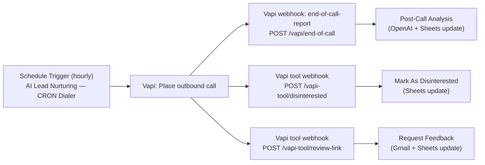

# Vapi + n8n Lead Nurturing Workflows (TypeScript, n8n-as-code)

This repo contains **four interconnected n8n workflows** that implement a simple outbound lead-nurturing loop using:

- **Vapi** (place outbound calls, send tool webhooks, emit end-of-call webhooks)
- **Google Sheets** (lightweight CRM / queue)
- **OpenAI** (post-call transcript analysis)
- **Gmail** (fallback + feedback emails)

The workflows are defined as TypeScript using `@n8n-as-code/transformer`-style decorators.

## Workflows

- `AI Lead Nurturing — CRON Dialer.workflow.ts`
  - Reads `Leads` from Google Sheets
  - Filters to rows with `Call Status = Pending`
  - Calls the Vapi `call/phone` API with lead metadata (name/email/rowNumber)
  - Updates the sheet to `Call Status = Initiated`

- `Vapi Post-Call Analysis.workflow.ts`
  - Receives Vapi **end-of-call-report** webhooks at `POST /vapi/end-of-call`
  - Extracts transcript + metadata
  - If answered (transcript exists): sends transcript to OpenAI for a small JSON summary
  - Updates the sheet with sentiment + recommended action
  - If not answered: sends a fallback email via Gmail

- `Vapi Tool — Mark As Disinterested.workflow.ts`
  - Receives Vapi **tool** webhook at `POST /vapi-tool/disinterested`
  - Marks the lead as opted out in Google Sheets

- `Vapi Tool — Request Feedback.workflow.ts`
  - Receives Vapi **tool** webhook at `POST /vapi-tool/review-link`
  - Emails the lead a feedback prompt (reply-to-email style)
  - Updates the sheet so you can track that the request was sent

## How They Connect (High-Level)

## Prerequisites

- An n8n instance you control (cloud or self-hosted)
- Vapi account (assistant + phone number)
- Google account for Sheets OAuth2
- Google account for Gmail OAuth2
- OpenAI API access (for transcript analysis)

## Configuration (Placeholders You Must Replace)

These workflow files are sanitized for public sharing and include placeholders you must update:

- `YOUR_GOOGLE_SHEETS_OAUTH2_CRED_ID`
- `YOUR_GMAIL_OAUTH2_CRED_ID`
- `YOUR_OPENAI_CRED_ID`
- `YOUR_VAPI_HEADER_AUTH_CRED_ID`
- `YOUR_GOOGLE_SHEET_DOC_ID`
- `YOUR_VAPI_ASSISTANT_ID`
- `YOUR_VAPI_PHONE_NUMBER_ID`
- `{{YOUR_BRAND_NAME}}`, `{{YOUR_PRODUCT_NAME}}`, `{{YOUR_TEAM_NAME}}`

In n8n, you can keep the names the same and just set the correct credential IDs, or update both `id` and `name` to match your instance.

## Google Sheet Expectations

The workflows assume a spreadsheet with a sheet named **`Leads`** and (at minimum) these columns:

- `Lead Name`
- `Phone`
- `Email`
- `Signup Date`
- `Call Status` (e.g. `Pending`, `Initiated`, `Completed`, `Opt-out`, `Review Requested`)
- `Recommended Action`
- `row_number` (used for updates; many n8n Google Sheets nodes expose this automatically)

The post-call analysis workflow also writes (if you keep the same mapping):

- `Sentiment Score`
- `Feedback Summary`

## Vapi Webhook Setup

Configure Vapi to call your n8n webhook endpoints:

- End-of-call report webhook: `POST https://<YOUR_N8N_BASE_URL>/webhook/vapi/end-of-call`
- Tool webhook (disinterested): `POST https://<YOUR_N8N_BASE_URL>/webhook/vapi-tool/disinterested`
- Tool webhook (review link): `POST https://<YOUR_N8N_BASE_URL>/webhook/vapi-tool/review-link`

Notes:

- Your exact webhook base path can differ depending on n8n settings; the **paths** above come from the workflow definitions.
- The workflows expect Vapi to include lead metadata on the call (e.g. `leadName`, `email`, `rowNumber`) so the webhook can map updates back to the correct sheet row.

## Security Notes

- Do not commit secrets (API keys, OAuth tokens, private webhook URLs).
- This repo intentionally uses placeholders instead of real credential IDs and document IDs.
- Consider rate limiting / auth on webhook endpoints if exposing them publicly.

