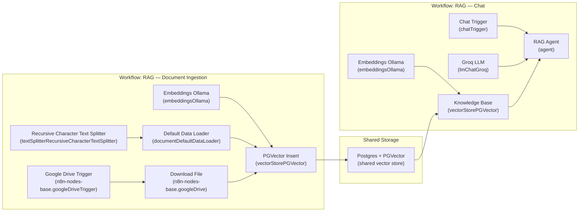

# RAG — Chat (n8n Workflow Export)

This folder contains sanitized n8n workflow exports:

- `RAG — Chat.workflow.json`
- `RAG — Document Ingestion.workflow.json`

It’s intended for portfolio sharing and reuse. Instance-specific credential bindings have been removed.

## How The Two Workflows Fit Together

In short: ingestion watches Google Drive, fetches new/updated files, chunks them, embeds them, and inserts them into **PGVector**. The chat workflow queries that same PGVector store as its “Knowledge Base” tool.

## Import Into n8n

1. In n8n, go to **Workflows**.
2. Use **Import from File** and select `RAG — Chat.workflow.json`.
3. Open the workflow and re-connect the required credentials.

## Credentials / Configuration

Each export includes `meta.redactedCredentials` to hint which credential types were removed. These workflows use:

- `postgres`
- `ollamaApi`
- `groqApi`
- `googleDriveOAuth2Api`

After importing, open each affected node and select the correct credential(s) for your instance.

## Notes

- The JSON is exported with `"active": false` so importing it won’t auto-enable anything.
- Pinned data and static workflow data are stripped from this public export.
